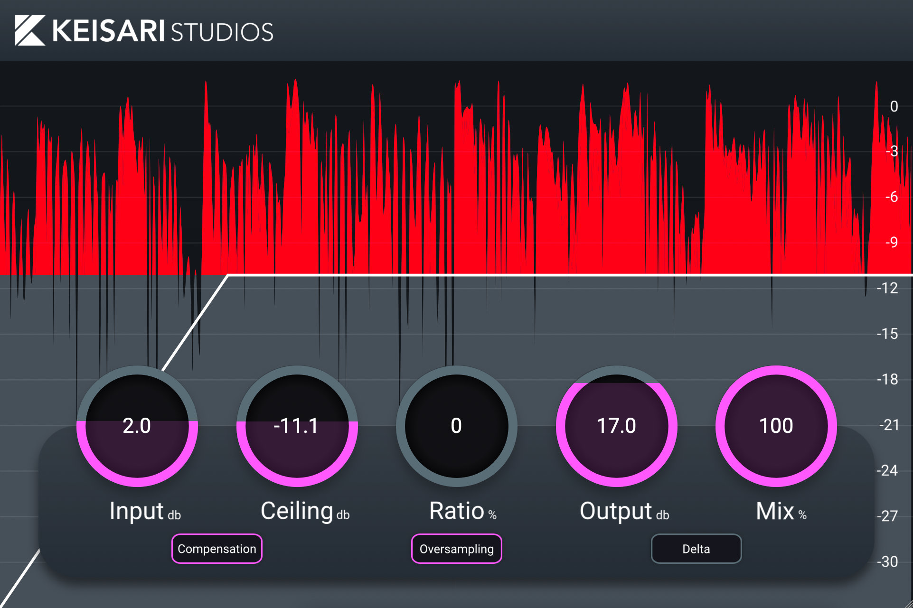

# Leikkaus

A dynamic clipper effect plugin.
 
Leikkaus is compatible with both Windows and MacOS (Intel/Apple Silicon). Available as a VST3 and AU plugin.

## User Interface

## Download

To download the latest release, visit the [official website](https://eemilahonen.github.io/plugins/leikkaus).

## Credits

- Lead Developer & Graphics - [Keisari](https://github.com/EemilAhonen)
- Plugin name - [Outobugi](https://github.com/outobugi)
- Feature and UI layout ideas from - [Turbo](https://www.youtube.com/@TurboA)

## Special Thanks

I express my gratitude to anyone who provided support, feedback, or additional contributions, even if they didn't directly work on the codebase.

## License

The source code is licensed under the GPLv3. For more details, please see the [license documentation](LICENSE).
